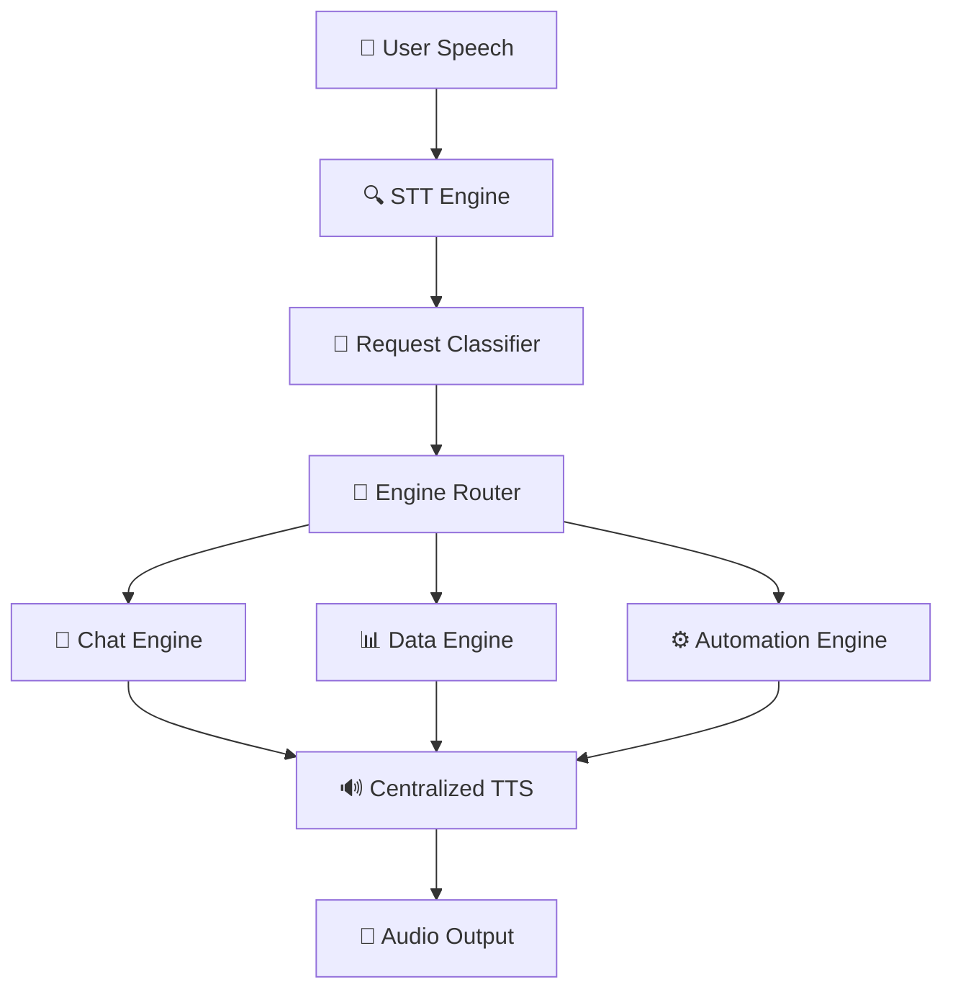

# A.R.I.S.E. 🤖
**Advanced Real-time Intelligent System for Execution**  

<div align="center">

 
 
 


### 🎯 A voice-controlled desktop AI assistant that combines speech recognition, intelligent conversation, real-time data fetching, and system automation into a seamless experience.

**Talk to it naturally and watch it execute tasks, answer questions, and control your computer.**

</div>

---

## 🎥 Current Status
<div align="center">

### ✅ **FULLY FUNCTIONAL** - A.R.I.S.E. is complete and ready to use!

</div>

| Feature | Status | Description |
|---------|--------|-------------|
| 🎤 **Voice Recognition** | ✅ Complete | Real-time speech-to-text with Google Speech Recognition |
| 🔊 **Text-to-Speech** | ✅ Complete | Natural voice responses at 180 WPM (human-like speed) |
| 🔐 **Voice Security** | ✅ Complete | SpeechBrain-powered voice enrollment and verification |
| 🧠 **Multi-Engine Architecture** | ✅ Complete | Chat, Data, and Automation engines working independently |
| ⚡ **Ultra-Fast Automation** | ✅ Complete | Opens applications in ~0.06 seconds |
| � **YouTube Playback** | ✅ Complete | Voice-controlled music, video, and movie playback |
| �🌐 **Real-time Data** | ✅ Complete | Weather, stocks, news, and web information |
| 🗣️ **Consistent Audio** | ✅ Complete | Every response includes voice output - no silent responses |
| 💭 **Persistent Memory** | ✅ Complete | Session history and long-term fact storage with context awareness |
| 😴 **Standby Mode** | ✅ Complete | Voice-controlled sleep mode with wake command functionality |
| 📍 **Location Awareness** | ✅ Complete | Auto-detects location from user facts for weather and data services |
| 🎯 **Seamless Verification** | ✅ Complete | Single voice input for both command and identity verification |

---

## 🚀 Features

<table>
<tr>
<td width="50%">

### 🎯 Core Functionality
- 🎙️ **Voice-First Interface**: Speak naturally, no keywords needed
- 🔐 **Secure Voice Recognition**: SpeechBrain-powered speaker verification with one-time enrollment
- 🎯 **Seamless Verification**: Single voice input handles both commands and identity verification
- 🧠 **Intelligent Classification**: Automatically routes requests to appropriate engine
- 💬 **Conversational AI**: Powered by Google Gemini for natural conversations
- 📊 **Real-time Data**: Live weather, stock prices, news headlines
- 🖥️ **System Automation**: Voice-controlled application launching
- 🎵 **YouTube Playback**: Voice-controlled music, video, and movie streaming
- 🔄 **Continuous Operation**: Hands-free conversation loop
- 💭 **Persistent Memory**: Remembers facts and conversation history across sessions
- 😴 **Standby Mode**: Voice-controlled sleep mode with "Hey A.R.I.S.E." wake command
- 📍 **Location Awareness**: Weather and data services use your stored location preferences

</td>
<td width="50%">

### ⚡ Technical Excellence
- 🚀 **Optimized Performance**: Sub-second response times
- 🎯 **Reliable TTS**: Audio plays for every single response
- 🔧 **Modular Design**: Independent engines with centralized coordination
- � **Advanced Security**: SpeechBrain AI-powered voice authentication with dual verification methods
- 🎯 **Zero Friction UX**: Single voice input for command processing and identity verification
- �📝 **Comprehensive Logging**: Full debug and performance tracking
- 🛡️ **Error Handling**: Graceful fallbacks and recovery mechanisms
- 🔄 **Auto-Recovery**: Self-healing system architecture

</td>
</tr>
</table>

---

## 🛠 Tech Stack

<div align="center">

| Category | Technologies |
|----------|-------------|
| **Backend** | Python 3.10+, speech_recognition, pyttsx3, google-generativeai, requests |
| **AI/ML** | SpeechBrain, torch, torchaudio, librosa for voice recognition |
| **Frontend** | Vite + React, Electron for desktop app |
| **Voice** | Google Speech Recognition, Windows SAPI Text-to-Speech |
| **APIs** | Google Gemini AI, OpenWeatherMap, News APIs |
| **Architecture** | Event-driven, multi-engine with centralized TTS and voice security |

</div>

---

## 📁 Project Structure

```
📦 arise-ai/
├── 🖥️ backend/
│   ├── 🎯 main.py                    # Main orchestrator with centralized TTS
│   ├── 📂 modules/
│   │   ├── 🔊 tts_engine.py         # Optimized text-to-speech (180 WPM)
│   │   ├── 🎤 stt_engine.py         # Speech recognition with audio recording
│   │   ├── 🔐 voice_recognition.py  # SpeechBrain-powered voice security
│   │   ├── ⚙️ automation_engine.py   # Ultra-fast app launching + YouTube playback
│   │   ├── 📱 app_scanner.py        # System application detection
│   │   ├── 💭 memory_manager.py     # Session history and facts storage
│   │   └── 🧠 brain/
│   │       ├── 💬 chat_brain.py     # Conversational AI (Gemini)
│   │       └── 📊 data_engine.py    # Real-time data fetching
│   ├── 📁 data/
│   │   ├── 📋 applications.json     # Scanned applications database
│   │   ├── 📝 facts.json           # Long-term memory facts
│   │   ├── 🔐 users.json           # Voice recognition profiles
│   │   ├── 💬 sessions/             # Conversation session storage
│   │   ├── 🎤 voice_features/       # Voice enrollment data
│   │   └── 🤖 speechbrain_cache/    # AI model cache
│   └── 📄 requirements.txt
├── 🎨 frontend/
│   ├── 📂 src/                      # React components
│   ├── ⚙️ electron/                 # Electron main process
│   └── 📄 package.json
└── 📖 README.md
```

---

## ⚡ Installation & Setup

<div align="center">

### 🚀 Get started in under 2 minutes!

</div>

### 1️⃣ Clone Repository
```bash
git clone https://github.com/XHLEIK/arise-ai.git
cd arise-ai
```

### 2️⃣ Backend Setup
```bash
cd backend
pip install -r requirements.txt

# Set up your API keys in modules/brain/.env
echo "GEMINI_API_KEY=your_gemini_api_key_here" > modules/brain/.env
```

### 3️⃣ Run A.R.I.S.E.
```bash
python main.py
```

### 4️⃣ Frontend (Optional)
```bash
cd ../frontend
npm install
npm run dev
```

---

## 🎯 How to Use

<div align="center">

### 🎤 Just speak naturally - no wake words needed!

</div>

| Step | Action | Description |
|------|--------|-------------|
| 1️⃣ | **Start A.R.I.S.E.** | Run `python main.py` in the backend directory |
| 2️⃣ | **Listen for greeting** | Wait for "Hello! I'm A.R.I.S.E..." |
| 3️⃣ | **Speak naturally** | No keywords needed, just talk! |

### 💡 Example Commands

<table>
<tr>
<td width="50%">

#### 💬 **Chat Examples**
```
"How are you today?"
"Tell me a joke"
"What do you think about AI?"
"Can you help me with something?"
```

#### 🌤️ **Weather Examples**
```
"What's the weather like?"
"Is it going to rain today?"
"How hot is it outside?"
"Weather forecast for tomorrow"
```

</td>
<td width="50%">

#### 📈 **Stock Examples**
```
"Tesla stock price"
"How's the market doing?"
"Apple stock performance"
"What's trending in stocks?"
```

#### 🖥️ **Automation Examples**
```
"Open Facebook"
"Launch Chrome"
"Start calculator"
"Run notepad"
```

#### 🎵 **YouTube Playback Examples**
```
"Play Shape of You"
"Watch Inception trailer"
"Listen to classical music"
"Show me funny cat videos"
"Put on some jazz music"
"Play Bohemian Rhapsody"
```

#### 💭 **Memory Examples**
```
"Delete memory"
"Clear memory" 
"Remove all memory"
"Forget everything"
```

#### 😴 **Standby Mode Examples**
```
"Go to standby"
"Sleep mode"
"Stand by"
"Enter standby"

Wake commands:
"Hey arise"
"Arise"
"Wake up arise"
```

#### 🔐 **Voice Security Examples**
```
First time setup:
"Enroll my voice"
"Setup voice recognition"
"Register my voice"

After enrollment (seamless verification):
"Hello A.R.I.S.E." → Automatically verified + processed
"What's the weather?" → Single input for command + verification
"Open Chrome" → No double voice input needed
```

</td>
</tr>
</table>

#### 🚪 **Exit Commands**
```
"Goodbye" | "Exit" | "Stop" | "See you later"
```

---

## 🏗️ Architecture Overview

<div align="center">

### 🎯 **Centralized TTS Architecture** - Every response includes voice!

</div>



### 🔧 Engine Responsibilities

| Engine | Icon | Purpose | Performance |
|--------|------|---------|-------------|
| **Chat Brain** | 🧠 | Conversational AI using Google Gemini | Instant responses |
| **Data Engine** | 📊 | Real-time information (weather, stocks, news) | < 1 second |
| **Automation Engine** | ⚙️ | System tasks, app launching, and YouTube playback | 0.06 seconds |
| **STT Engine** | 🎤 | Speech recognition and audio processing | Real-time |
| **Voice Recognition** | 🔐 | SpeechBrain-powered speaker verification | 0.6s verification |
| **TTS Engine** | 🔊 | Voice synthesis with optimized timing | 180 WPM |
| **App Scanner** | 📱 | System application discovery and management | Background |
| **Memory Manager** | 💭 | Session storage and long-term fact retention | Instant |

---

## 🛠 Troubleshooting

<details>
<summary>🎵 <strong>Audio Issues</strong></summary>

- ✅ Ensure microphone permissions are granted
- ✅ Check Windows audio settings (44.1kHz recommended)
- ✅ Verify speakers/headphones are working
- ✅ Test with `python -c "from modules.tts_engine import TTSEngine; TTSEngine().speak('test')"`

</details>

<details>
<summary>🔑 <strong>API Issues</strong></summary>

- ✅ Confirm Gemini API key is set in `modules/brain/.env`
- ✅ Check internet connection for data requests
- ✅ Review logs in console for specific errors
- ✅ Verify API key format and permissions

</details>

<details>
<summary>⚡ <strong>Performance</strong></summary>

- ✅ A.R.I.S.E. is optimized for sub-second responses
- ✅ Application launching: ~0.06 seconds
- ✅ TTS speed: 180 WPM (natural human speech)
- ✅ Memory usage: < 100MB

</details>

---

## 📈 Project Status & Roadmap

<div align="center">

### 🎯 **Production Status Dashboard**

</div>

| Component | Status | Performance | Notes |
|-----------|--------|-------------|-------|
| 🎤 Speech Recognition | ✅ **Complete** | Real-time, Google API | Production ready |
| 🔊 Text-to-Speech | ✅ **Complete** | 180 WPM, 100% reliability | Optimized |
| 💬 Chat Engine | ✅ **Complete** | Gemini AI integration | Advanced AI |
| 📊 Data Engine | ✅ **Complete** | Weather, stocks, news | Real-time data |
| ⚙️ Automation | ✅ **Complete** | 0.06s app launching | Ultra-fast |
| � Memory System | ✅ **Complete** | Session & fact storage | Context-aware |
| �🖥️ Desktop UI | 🚧 **In Progress** | React + Electron | 70% complete |
| 📱 Mobile App | 🔜 **Planned** | Cross-platform | Future release |

### 🏆 Recent Achievements

<div align="center">

| Achievement | Impact | Status |
|-------------|---------|---------|
| � **Voice Security Integration** | SpeechBrain-powered speaker verification | ✅ Complete |
| 🎯 **Seamless Verification** | Single voice input for command + identity | ✅ Complete |
| �🔊 **Fixed TTS Consistency** | Audio now plays for every response | ✅ Complete |
| ⚡ **Optimized Voice Speed** | Natural 180 WPM speech rate | ✅ Complete |
| 🚀 **Ultra-Fast Automation** | 30-second delays → 0.06 seconds | ✅ Complete |
| 🏗️ **Centralized Architecture** | Eliminated circular dependencies | ✅ Complete |
| 🛡️ **Enhanced Reliability** | Multiple TTS fallback methods | ✅ Complete |
| 💭 **Memory Integration** | Persistent conversation memory | ✅ Complete |

</div>

---

## 🤝 Contributing

<div align="center">

### 🚀 **Join the A.R.I.S.E. development team!**

</div>

| Step | Action |
|------|--------|
| 1️⃣ | Fork the repository |
| 2️⃣ | Create feature branch: `git checkout -b feature-name` |
| 3️⃣ | Make changes and test thoroughly |
| 4️⃣ | Commit: `git commit -m 'Add feature'` |
| 5️⃣ | Push: `git push origin feature-name` |
| 6️⃣ | Create Pull Request |

### 📋 **Development Guidelines**
- ✅ Follow Python PEP8 standards
- ✅ Maintain modular architecture
- ✅ Add comprehensive error handling
- ✅ Test voice functionality thoroughly
- ✅ Update documentation

---

## 📜 License

<div align="center">

**MIT License** - Feel free to use, modify, and distribute.

---

### 🎯 **A.R.I.S.E. is production-ready and actively maintained.**

**Built with ❤️ by [XHLEIK](https://github.com/XHLEIK)** | **⭐ [Star on GitHub](https://github.com/XHLEIK/arise-ai)**

</div>
